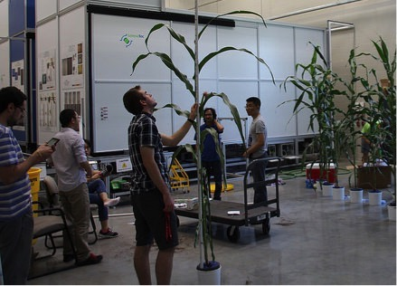

Research in the Schnable Lab@UNL in an interdisciplinary business. Our projects involving collaborations with engineers, computer scientists, statisticians, and food scientists. Current work in the lab focuses on three major overlapping areas

<ul>
<li><a href="#Comparative">Linking Genotype and Phenotype Across Grass Species</a></li>
<li><a href="#Phenotyping">Automated Plant Phenotyping</a></li>
<li><a href="#Food4health">Engineering the Human Gut Microbiome Using Plant Metabolites</a></li>
<li><a href="#Orphan">Miscellaneous Other Cool Science</a></li>
</ul>

<a id="Comparative">

**Linking Genotype and Phenotype Across Environments and Across Grass Species**

{:width="500"}

Lots of interesting (where "interesting" can mean agronomically useful, or evolutionarily interesting, or just cool) traits show much more variation between species than within populations of a single species. One of the long term goals of our lab is to develop tools to study functional genetic variation across multiple species. Several of the currently funded projects within the lab fall under this umbrella.

**Identifying Mechanisms Conferring Low Temperature Tolerance in Maize, Sorghum, and Frost Tolerant Relatives**

Low temperature is a key constraint on crop productivity and growing ranges and even within the native ranges of crop species, unseasonable early or late cold can both reduce yield and decrease the quality of any surviving harvest. To date, the majority of research into the mechanisms responsible for cold tolerance have been focused in the model eudictot species A. thaliana. However, more recent studies of cold tolerance in the Pooideae grass subfamily (wheat, barley, rye etc) have revealed novel cool temperature adaptive mechanisms which are not shared by closely allied subfamilies within the grasses such as the Ehrhartoideae (rice). This finding suggests different plant lineages have adapted to growth in cool season environments using distinct genetic and physiological mechanisms. This project will determine a set of genes and metabolic pathways critical for low temperature tolerance in the Panicoideae, a grass subfamily which includes the major, cold-sensitive, crops corn (Z. mays) and sorghum (S. bicolor) through the characterization of parallel adaptations to cool and cold environments present within the subfamily. The completion of this project will both increase the number of known mechanisms by which plant species can become low temperature tolerant and generate a specific set of gene and metabolite changes required for cold and freezing tolerance in panicoid species. These outcomes will generate a toolkit that will enable the development of low temperature tolerant corn and sorghum through both the mining of natural allelic variation and engineering approaches.

Supported by a grant from the USDA NIFA to the Schnable lab and our collaborators in [the Roston Lab](https://www.rostonlab.com/) (Biochemistry): 2016-67013-24613

**Recent Publications On Plant Comparative Omics**

1.**Lai X, Yan L**, Lu Y, **Schnable JC**. (2018) [Largely unlinked gene sets targeted by selection for domestication syndrome phenotypes in maize and sorghum.](https://doi.org/10.1111/tpj.13806) *The Plant Journal* doi: 10.1111/tpj.13806  *bioRxiv* doi: 10.1101/184424
2. **Liang Z**, **Schnable JC** (2018) [Functional Divergence Between Subgenomes and Gene Pairs After Whole Genome Duplications.](https://doi.org/10.1016/j.molp.2017.12.010) *Molecular Plant* doi: 10.1016/j.molp.2017.12.010
3. **Zhang Y**, **Ngu DW**, **Carvalho D**, **Liang Z**, Qiu Y, Roston RL, **Schnable JC**. (2017) [Differentially regulated orthologs in sorghum and the subgenomes of maize.](http://dx.doi.org/10.1105/tpc.17.00354) *The Plant Cell* doi: 10.1105/tpc.17.00354 *bioRxiv* preprint doi: 10.1101/120303
4. **Lai X**,* Behera S,* **Liang Z**, Lu Y, Deogun JS, **Schnable JC**. (2017) [STAG-CNS: An order-aware conserved noncoding sequence discovery tool for arbitrary numbers of species.](http://dx.doi.org/10.1016/j.molp.2017.05.010) *Molecular Plant* doi: 10.1016/j.molp.2017.05.010 *bioRxiv* preprint doi: 10.1101/120428

{:width="120" align="middle"}

 
**Automated Plant Phenotyping**
 
{:width="120" align="middle"}

The Schnable lab works with both the "Data Analysis" team within the Center for Integrative Translational Biology and the <a href="http://plantvision.unl.edu/">Plant Vision Initiative</a> in developing and deploying new algorithms, tools, and datasets for high throughput plant phenotyping. Our work in this area is supported by the USDA, and internal funding from the University of Nebraska Lincoln. In 2017, we will be creating and disseminating a reference high throughput imaging dataset for the Sorghum Association Panel. Check back for more details starting in March 2017.
 

**A High Throughput Phenotyping Reference Dataset for GWAS in Sorghum**

The Consortium for Integrated Translational Biology was founded with the goal of linking variation in phenotype to variation in genotype and translate research from the greenhouse to the field. The initial validation studies of the Scanalyzer 3D were not able to include sufficiently large populations to allow the de novo mapping of genes controlling either traditional or novel phenotypic traits. This proposal aims to generate a first generation sorghum high throughput phenotype reference dataset through the phenotyping and ground truth analysis of 363 accessions from the Sorghum Association Panel (SAP). A publicly available dataset from this population will enable and encourage researchers to develop and validate new computational methods of scoring plant phenotypes using conventional or hyperspectral image data. And, when a trait is validated, it will be possible to perform GWAS to identify traits associated SNPs (TASs) associated with the genes controlling variation in those phenotypes in sorghum.

{:width="500" align="middle"}

We propose developing new software tools and statistical models to measure reproductive stage phenotypes from conventional RGB image data, measure sorghum plant composition phenotypes from hyperspectral data, and identify genes or candidate intervals for genes responsible for controlling variation in plant architecture, plant composition, and derived traits (i.e. ratios between specific traits, and rates of change in trait measurements over time). The creation of this dataset will stimulate the development of new methods, and serve as critical preliminary data for future research proposals by both the proposing research teams and other faculty working on sorghum, maize, and related crops.

*Supported by an internal award from the Agricultural Research Division to our lab and multiple collaborators at UNL.*

**PAPM EAGER: Transitioning to the Next Generation Plant Phenotyping Robots**

{:width="500" align="middle"}

This project is to develop next generation plant phenotyping robots that can collect in-vivo human-like measurement of plant physiological and chemical traits to complement image analysis. This project is to address the perceived "phenotyping bottleneck". There are three specific research aims. The first is to design and develop robotic grippers integrating specialized plant sensors. The second is to develop a novel vision system for the localization and approaching of plant leaves by the robotic arm and eye-hand coordination. The third is to test and validate the plant phenotyping robot in UNL's high throughput phenotyping greenhouse. The PIs will also work to develop several novel educational and outreach activities in this project.

*Supported by a grant from the USDA NIFA to our collaborators in the <a href="http://engineering.unl.edu/bse/faculty/yufeng-ge-1/">Ge Lab</a> (Biological Systems Engineering):* 2017-67007-25941
 

**High-throughput, High-Resolution Phenotyping of Nitrogen Use Efficiency Using Coupled In-Plant and In-Soil Sensors**

The team will develop a novel technology toolset consisting of two types of sensors to accelerate plant breeding for nitrogen uptake and nitrogen use efficiency. The team will design and build a novel silicon microneedle in-plant nitrogen sensor and a microfluidic soil nitrogen sensor. Incorporating the new soil and in-plant sensors into real world field trials will improve and accelerate the effort to identify, select and commercialize new crops with improved nitrogen use efficiency.

_Supported by <a href="https://arpa-e.energy.gov/sites/default/files/documents/files/ROOTS_Project_Descriptions_Final.pdf"> an ARPA-E award lead by to our collaborators in the <a href="http://www.memslab.net/">Liang Dong lab at Iowa State</a>._

**Recent Publications on Plant Phenotyping**

<ol>
<li>**Liang Z**, Pandey P, Stoerger V, Xu Y, Qiu Y, Ge Y, **Schnable JC**. (2017) "<a href="https://academic.oup.com/gigascience/advance-article/doi/10.1093/gigascience/gix117/4656251?guestAccessKey=71c1c32f-78fd-42c0-99a3-38e6c4fd8100">Conventional and hyperspectral time-series imaging of maize lines widely used in field trials.</a>" *GigaScience* doi: 10.1093/gigascience/gix117 bioRxiv* doi: <a href="https://doi.org/10.1101/169045">10.1101/169045</a> </li>
<li>* Xu Y, Qiu Y, **Schnable JC**. (2018) "[Functional Modeling of Plant Growth Dynamics.](https://dl.sciencesocieties.org/publications/tppj/abstracts/1/1/170007)" *The Plant Phenome* doi: 10.2135/tppj2017.09.0007 *bioRxiv* doi: <a href="https://doi.org/10.1101/190967">10.1101/190967</a></li>
<li>Pandey P, Ge Y, Stoerger V, **Schnable JC**. (2017) "<a href="http://dx.doi.org/10.3389/fpls.2017.01348">High throughput in vivo analysis of plant leaf chemical properties using hyperspectral imaging</a>" *Frontiers in Plant Science* doi: 10.3389/fpls.2017.01348</li>
<li>Chaudhury SD, Steorger V, Samal A, **Schnable JC**, **Liang Z**, Yu J. (2016) "<a href="Pubs/Sruti_KDD_FEWS.pdf">Automated vegetative stage phenotyping analysis of maize plants using visible light images.</a>" *KDD: Data Science for Food, Energy, and Water* (Conference Proceedings)</li>
<li>Ge Y, Bai G, Stoerger V, **Schnable JC**. (2016) "<a href="http://dx.doi.org/10.1016/j.compag.2016.07.028">Temporal dynamics of maize plant growth, water use, and plant water content using automated high throughput RGB and hyperspectral imaging.</a>" *Computers and Electronics in Agriculture* doi: 10.1016/j.compag.2016.07.028</li>
</ol>

<a id="Food4health">
Engineering the Human Gut Microbiome Using Plant Metabolites
</a>

The newest research focus within the Schnable lab emphasizes combining quantitative genetic tools with high throughput screening of microbial communities to understand what components of food alter the population structure of the microbiomal community in the human gut. Working with the newly founded <a href="http://news.unl.edu/newsrooms/today/article/nebraska-food-for-health-center-to-unite-strengths-in-agriculture-medicine/">Food for Health Center</a>, we will use these perturbations to understand how different microbial taxa can influence human health in positive or negative fashions. 

<a id="Orphan">
Miscellaneous Other Cool Science
</a>

**Genomes to Fields**

{:width="500" align="middle"}

Working with the Rodriguez lab and the Ge Lab, we conduct field trials and high throughput phenotyping of exPVP maize hybrids ("the closest to what farmers in Nebraska grow today as we're legally allowed to work with") as part of the <a href="http://www.genomes2fields.org/">Genomes to Fields</a> public-private consortium working at catalyzing the translation of maize genomic information into advances beneficial to growers, consumers, and society. In 2016, members of the consortium collected yield and phenotype data from maize hybrids grown at 29 locations distributed across 17 states.

* Alkhalifah N, Campbell DA, Falcon CM, ... **Schnable JC** (31 of 42 authors) ... Spalding EP, Edwards J, Lawrence-Dill CJ (2018) "Maize Genomes to Fields: 2014 and 2015 field season genotype, phenotype, environment, and inbred ear image datasets." *BMC Research Notes* (Accepted pending minor revision)

*  **Liang Z**, Pandey P, Stoerger V, Xu Y, Qiu Y, Ge Y, **Schnable JC**. (2017) "<a href="https://academic.oup.com/gigascience/advance-article/doi/10.1093/gigascience/gix117/4656251?guestAccessKey=71c1c32f-78fd-42c0-99a3-38e6c4fd8100">Conventional and hyperspectral time-series imaging of maize lines widely used in field trials.</a>" *GigaScience* doi: 10.1093/gigascience/gix117 bioRxiv* doi: <a href="https://doi.org/10.1101/169045">10.1101/169045</a>  

*  Gage J, Jarquin D, Romay M, ... **Schnable JC** (29th of 40 authors) .. Yu J, de Leon N. (2017) "<a href="https://doi.org/10.1038/s41467-017-01450-2">The effect of artificial selection on phenotypic plasticity in maize.</a>" *Nature Communications* doi: 10.1038/s41467-017-01450-2  

*Our participation in Genomes to Fields is supported by the <a href="http://nebraskacorn.gov/">Nebraska Corn Board</a>*

**Genomic Selection Guided Breeding of Pearl Millet Hybrids
**

Members of the Schnable Lab@UNL are working with ICRISAT and the Schnable Lab@ISU to increase the rate of genetic gain in the yield of pearl millet, a drought and stress tolerant crop widely grown for both forage and human consumption in India and Africa.

* *Liang Z*, Gupta SK, Yeh CT, *Zhang Y*, *Ngu DW*, Kumar R, Patil HT, Mungra KD, Yadav DV, Rathore A, Srivastava RK, Gupkta R, *Yang J*, Varshney RK, Schnable PS, *Schnable JC* (2018) "[Phenotypic data from inbred parents can improve genomic prediction in pearl millet hybrids.](https://doi.org/10.1534/g3.118.200242)" _G3: Genes Genomes Genetics_ doi: 10.1534/g3.118.200242
[Chinese Language Summary](https://mp.weixin.qq.com/s/8mGpB0Uel0omoC5QFGjKmA)

_This work is supported by an award from ICRISAT that is in turn supported by funds from USAID_
